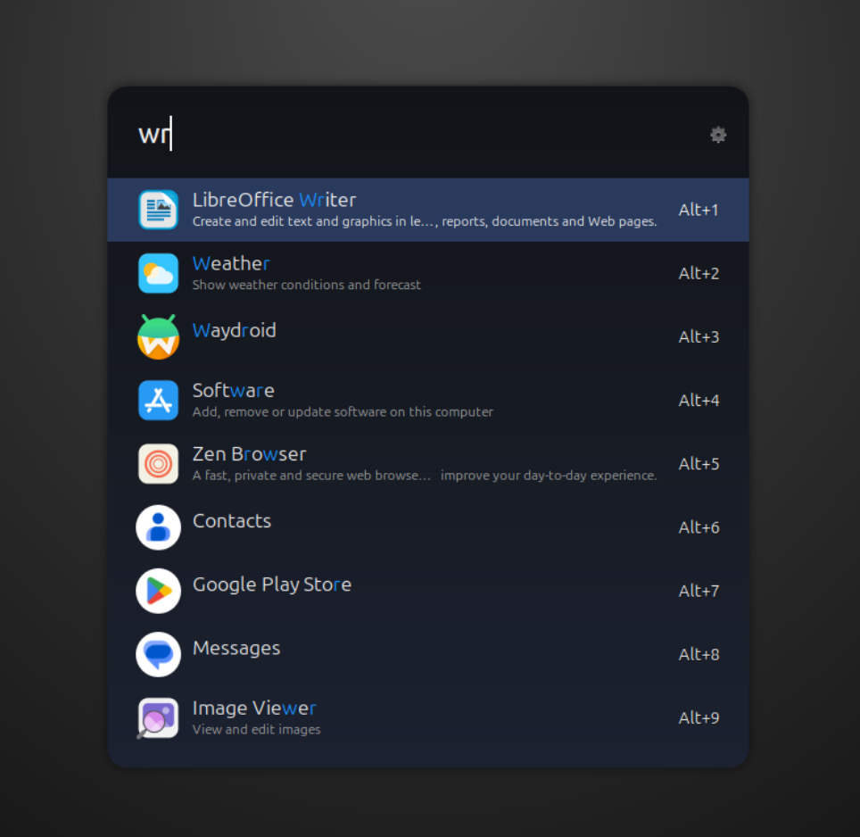

# Graphite Theme for Ulauncher

Graphite is a modern, elegant dark theme for [Ulauncher](https://ulauncher.io/), designed to provide a sleek, minimal, and visually comfortable experience. With subtle accents and carefully tuned contrast, Graphite is perfect for users who appreciate refined, distraction-free productivity.

## Features
- **Modern Graphite Look:** Dark backgrounds with soft contrast to reduce eye strain.
- **Blue Accent Highlights:** Stylish blue accent for selections and highlights.
- **Refined Font and Spacing:** Comfortable, readable layout with thoughtful padding and border radius.
- **Smooth Input & Selection Styles:** Designed to look great in both light and dark desktop environments.

## Installation

### 1. Download or Clone the Theme
Clone or download this repository to your machine:
```bash
git clone https://github.com/YOUR-USERNAME/ulauncher-graphite-theme.git
```
Or just download the source ZIP and extract the `Graphite` folder.

### 2. Move the Theme to Ulauncher Themes Directory
Copy the `Graphite` theme folder into Ulauncher's themes directory (~/.config/ulauncher/user-themes/):

```bash
mkdir -p ~/.config/ulauncher/user-themes/
cp -r Graphite ~/.config/ulauncher/user-themes/
```

### 3. Select Graphite Theme in Ulauncher
- Open Ulauncher Preferences (`Ctrl+Space` > gear icon or via tray menu)
- Go to the **"Theme"** tab
- Select **Graphite** from the theme list
- The changes should take effect immediately

## Customization
The theme consists of two main style files:
- `theme.css` – Main cross-platform look
- `theme-gtk-3.20.css` – Tweaks for systems with GTK 3.20 and later

You may further customize colors by editing these files inside the theme folder.

## Preview




## Credits
- Built for Ulauncher by [Your Name or Username]
- Inspired by modern dark UI trends

## License
[MIT](LICENSE) or your chosen license

---
For issues, suggestions, or to contribute, open an issue or pull request!
